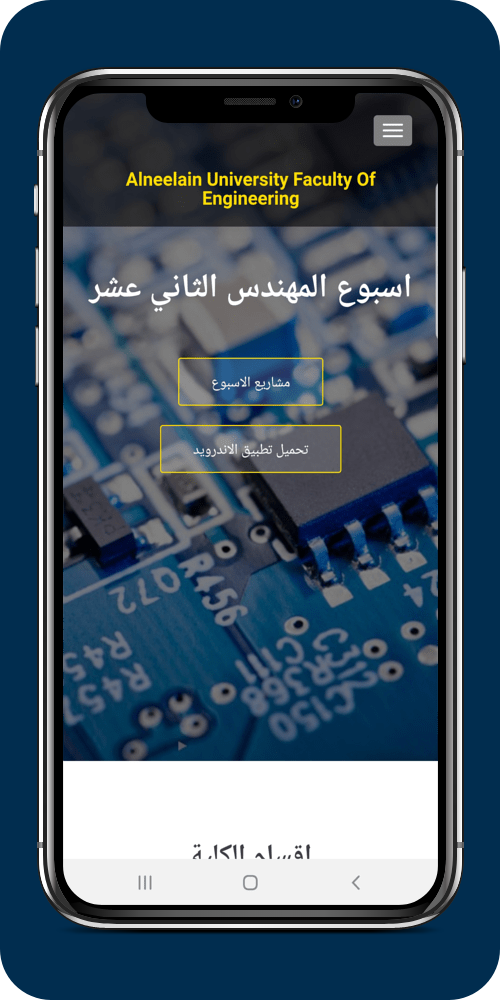
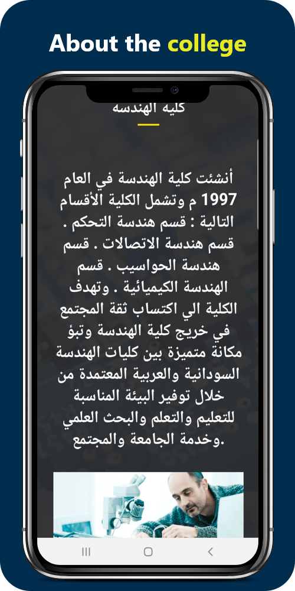
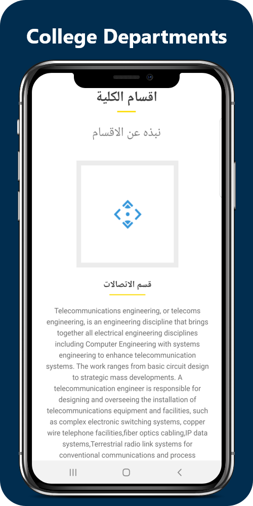
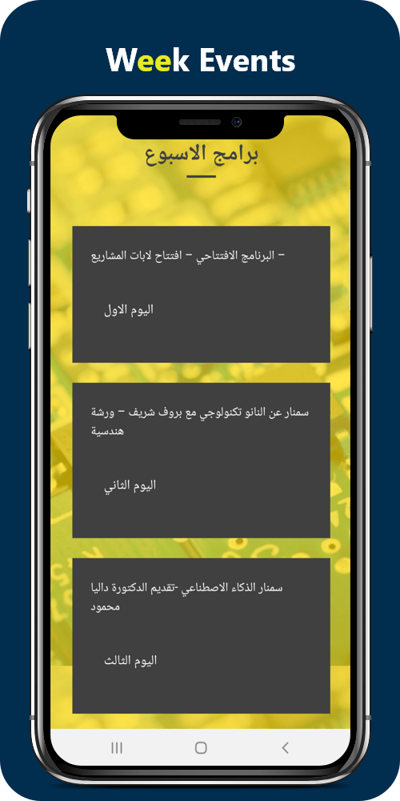
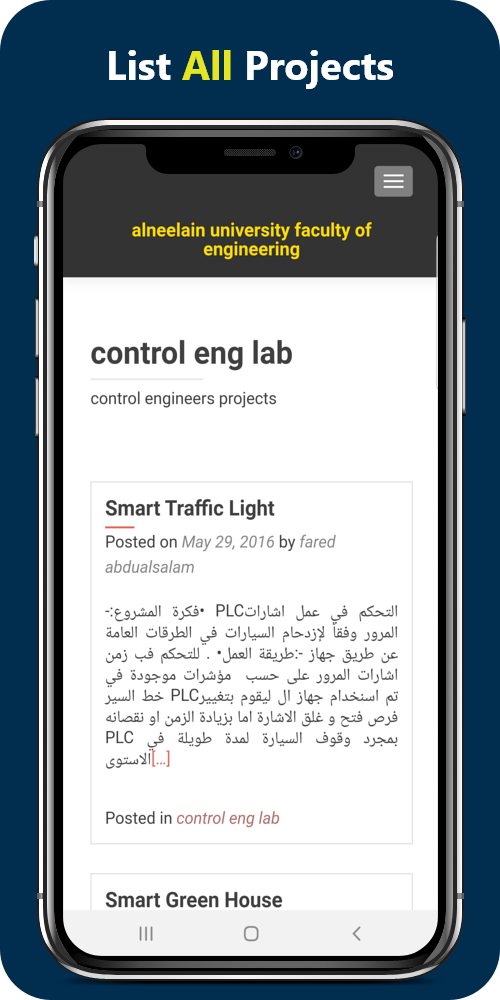
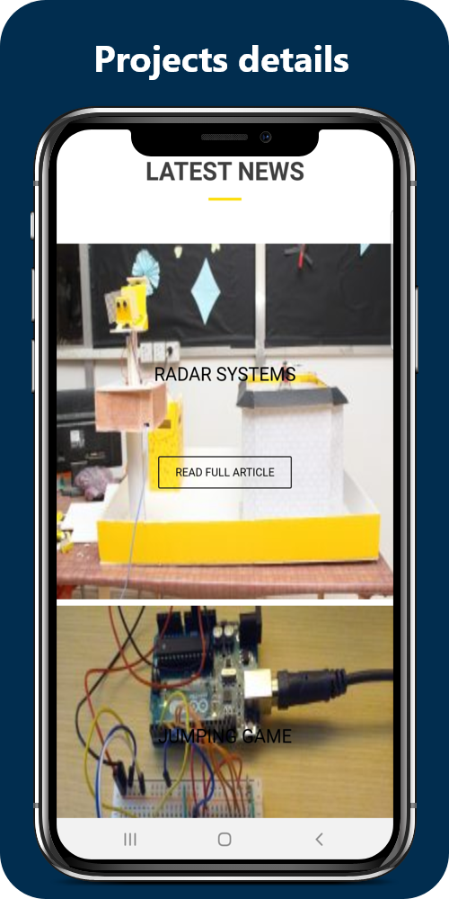

# Alneelain Week 12
Engineering weeek project for alneelain University.

## ScreenShots:

         
    
## App Features
1. Listing projects.
2. Listing week events.
3. About the week and the University. 

## App architecture
Native Android app developed using Java.

### App Specs
* Any version of android

------
## App link
* [Google play](https://play.google.com/store/apps/details?id=com.almissbah.week12)

